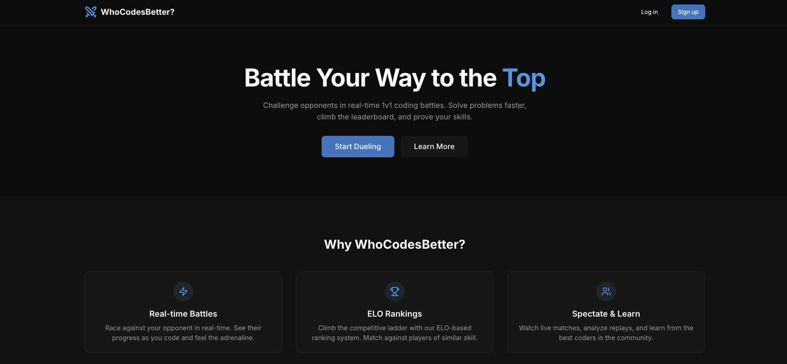
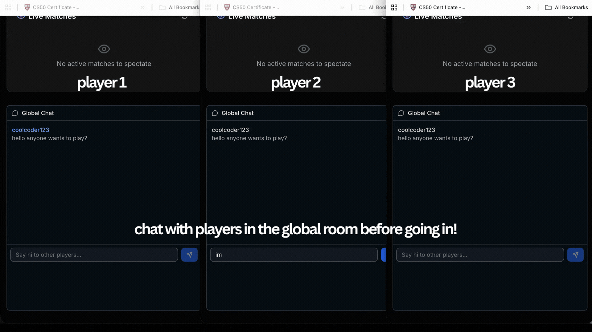
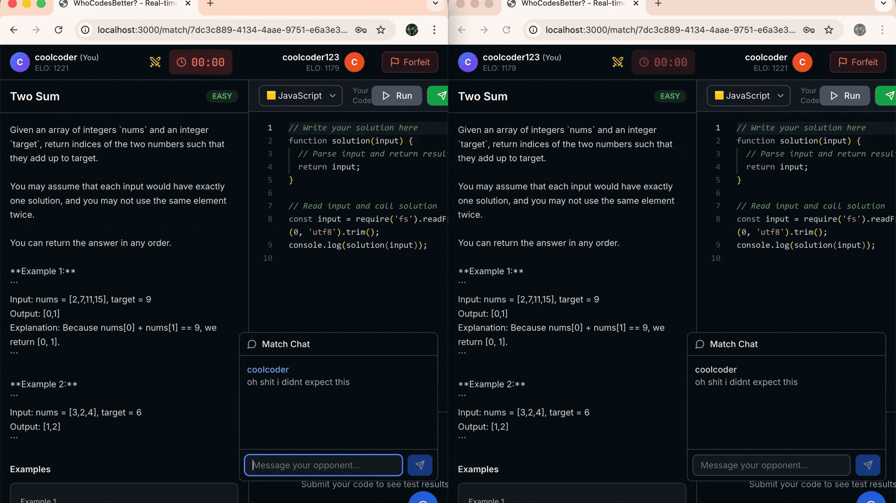
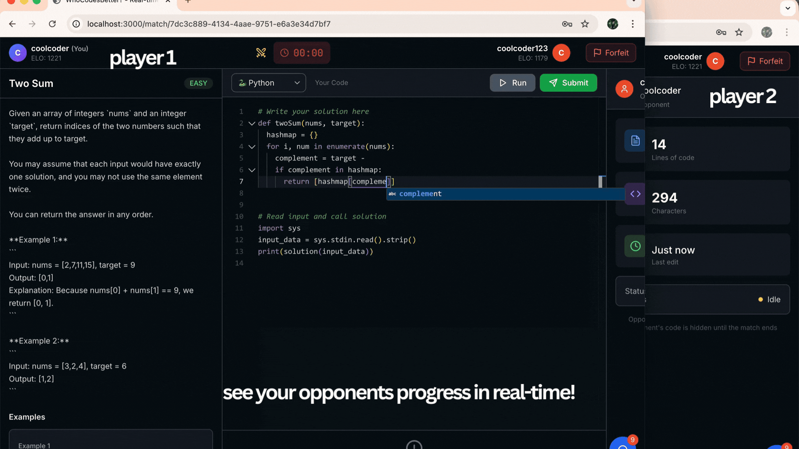
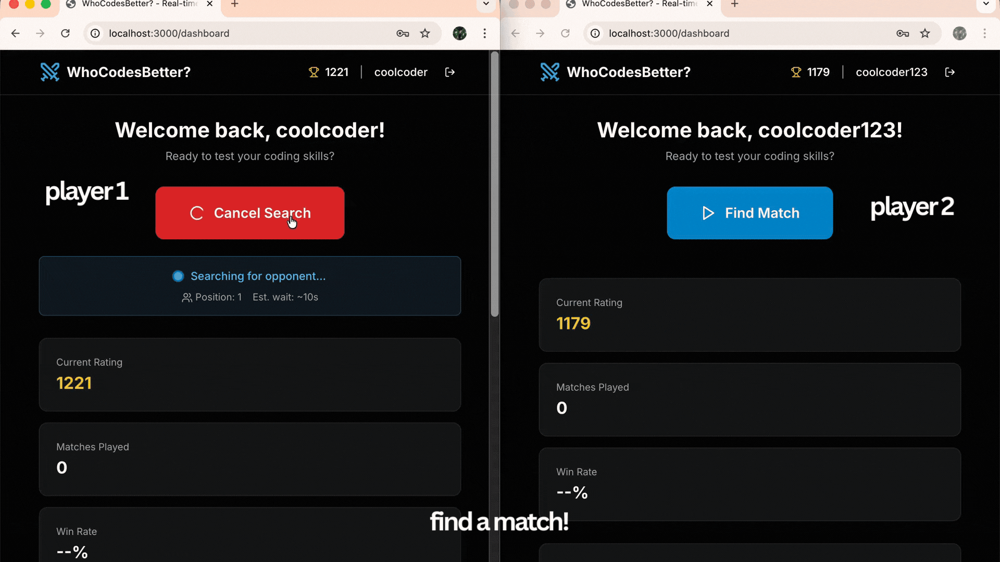

# WhoCodesBetter?

### *Bringing Competition To Coding*

Inspired by: CodeDuel [https://github.com/eladlevi013/CodeDuel](https://github.com/eladlevi013/CodeDuel)

## Technical Skills Involved
- Bidirectional WebSocket communication with Socket.IO
- Real-time code synchronization between players
- Live chat systems (global + match-specific)
- Redis State Management (Sorted Sets)
- Socket.IO Room-based Broadcasting
- ELO-Based Matchmaking Algorithm
- Debouncing and Performance Optimization

## Description
Not gonna lie, I thought that the CodeDuels idea was pretty cool. I have always been wondering what and how in-app messaging, matchmaking and coding works. So I decided to try to create one all by myself. 

Here are some of the lessons that I have learnt from this experience, including some of the features that I have built into the app. 
 

## Feature 1: Live Progress and Real-time Messaging Functions
### Feature 1a: Chat with everyone in the room 
This chat purely exists in the lobby, everyone connected to the app can chat on it. This is done through the socket event `io.emit('lobby_message', ...)`. Redis Key is `chat:lobby`, which is a single key that stores all the messages in the lobby. 

### Feature 1b: Trash Talk your opponent while coding!
Player 2 gets real time updates of player 1's progress as he codes. The updates are made to be as real time as possible, integrating Redis for persistence and Socket.IO to send information from the server to the client.

Optimisation Notes: 
1. **Debouncing** is used to limit rate of uploads to server and made to be smooth and efficient. 
2. **Socket.IO rooms** are used to ensure chats are only sent to users in the same match room and not broadcasted to the entire server. 
3. **Redis Persistence** allows users who disconnect or refresh the page to reconnect and continue the chat. 

### Feature 1c: Live Progress of your opponent
  - Code updates are debounced (200ms) to avoid flooding
  - Opponent's actual code is hidden (stored but not displayed)
  - Only activity indicators shown: line count, char count, typing status
  - After match ends, full code is revealed in the CodeEditor
  - Optimistic Updates: Own editor is updated first, then synced to opponents 

## Feature 2: Real-time matchmaking

### Feature 2a: Socket.IO with matchmaking queue (join/leave lobby)
To develop and create this, Redis was largely used to make the matchmaking queue. 

Features: 
- **Redis Sorted Set** is used to store users in lobby with their ELO as a score. This allows better matching as they are then able to match by their scores. 
- **ELO based matchmaking** allows users to have fair matches based on their skill level. 
- **Background loop** checks for matches every 2 seconds.
- **Expanding range** allows expansion of ELO from 200 to 500 over time, preventing a long wait time. 

## AI Declaration
AI was used to help with the frontend, help with learning through prompting and debug code when necessary. 

## Key Features Implemented
  - Monorepo: TurboRepo with npm workspaces
  - Database: PostgreSQL with migrations for users, problems, matches, OAuth accounts,
  refresh tokens
  - Authentication: Email/password + GitHub OAuth with JWT access/refresh tokens
  - API Endpoints: Register, login, logout, refresh, profile management, leaderboard
  - Real-time: Socket.IO with matchmaking queue (join/leave lobby)
  - Frontend: Landing page, auth pages, dashboard with ELO display and "Find Match" button
  - Docker: PostgreSQL 16, Redis 7, Piston code execution engine  